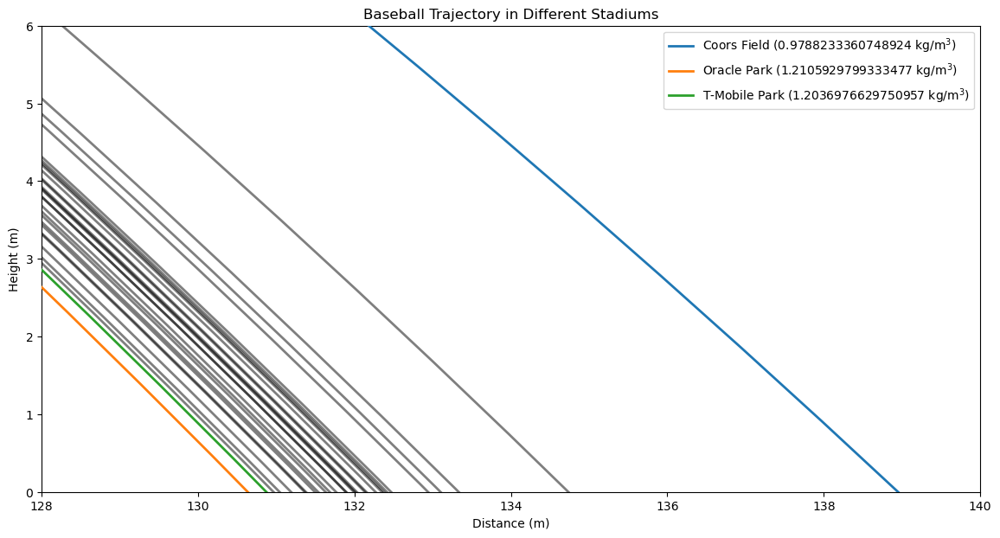

# T-Mobile Park's Effect On Major League Baseball in Seattle

The Seattle Mariners are the only Major League Baseball team to never appear in a World Series. Despite being near the middle of the pack in terms of payroll, Mariner teams since the early 2000s have been disappointing to say the least, with historically bad offenses in the 2010s. Since the team's move from their old stadium into what would become T-mobile Park (formerly Safeco Field), some analysts have noticed that batters seem to perform poorly in the stadium. Former sluggers who were traded to the Mariners would constantly under-perform with their new team, or so it seemed. Some analysts began to theorize there was some external factor causing batters to lose production when being traded to the Mariners. The most prominent theory is that the Seattle climate and the stadium itself that was causing hitters to under-perform. This theory is reinforced by the pitching statistics for Seattle which, since 2000, have been historically good. While a "cursed" stadium is a romantic way to explain the Mariner's historic woes, there is also a much more ordinary explanation: that Mariners have just been bad hitters. This project examines if hitting in Seattle is significantly "harder" or if players are worse when playing in Seattle by looking at historical batting numbers and investigating the physical conditions of T-Mobile Park. Read the full paper [here](paper/main.pdf).

# Atmosphere Effects

The three forces that determine the path of a baseball though the air are gravity, drag, and the Magnus force. This folder simulates these forces on a batted baseball (given parameters like velocity and spin rate) for a given MLB stadium using a combination of lattitude and longitude data scraped from Google Maps, as well as historical weather data scraped from the Open Mateo libraries. It also compares simulated hits to real hit data from Baseball Sevant (built on StatCast).

## trajectory_calculation.py

This file defines 4 helper functions that compute the drag and Magnus effect coefficents due to drag and the Magnus force, as well as the forces themselves based on the required input parameters. The 5th function combines these helper functions with the force due to gravity into a comprehensive function that numerically computes the flight path of the ball in the 2D x-z plane (keeing the same axis convention as StatCast) by computing the forces, the velocity, and position of the ball at time steps defined by the user.

# Historical Batting

## traded_player_performance.py

This file will contain functions to pull batting data of players who were traded to or from a team in a given time-span to compare thier performaces on the given team to all other teams to check for trends.

# Ancillary Data

This file contains extra useful data on MLB stadiums manually scraped from MLB.com and Google Maps. Elevation is rounded to the nearest meter. Data is up to date (2026). This is important for historical analysis considering the Athletics moved from Oakland in 2025 to Sacramento in 2026, and the Rays played in Tampa for the 2025 season due to huricane damage to Tropicana Field before returning in 2026.
